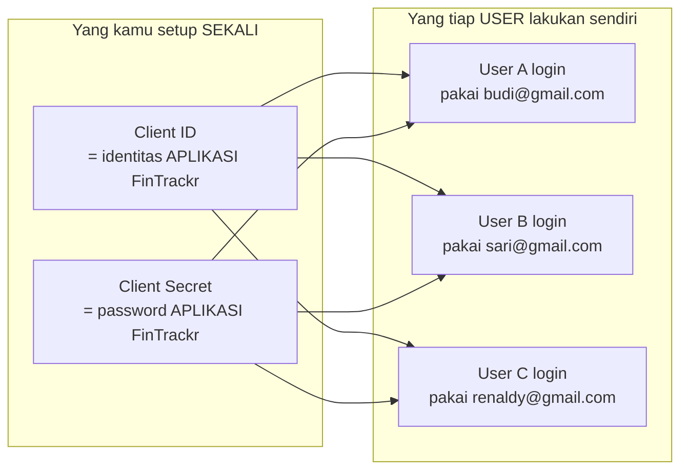
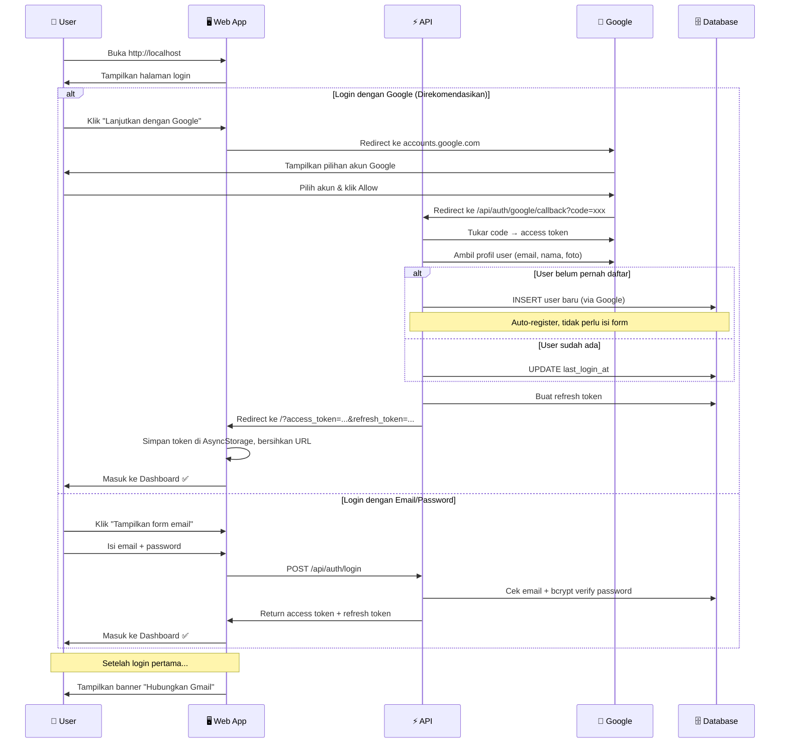
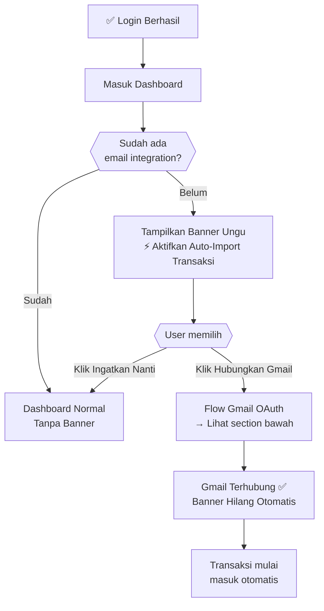
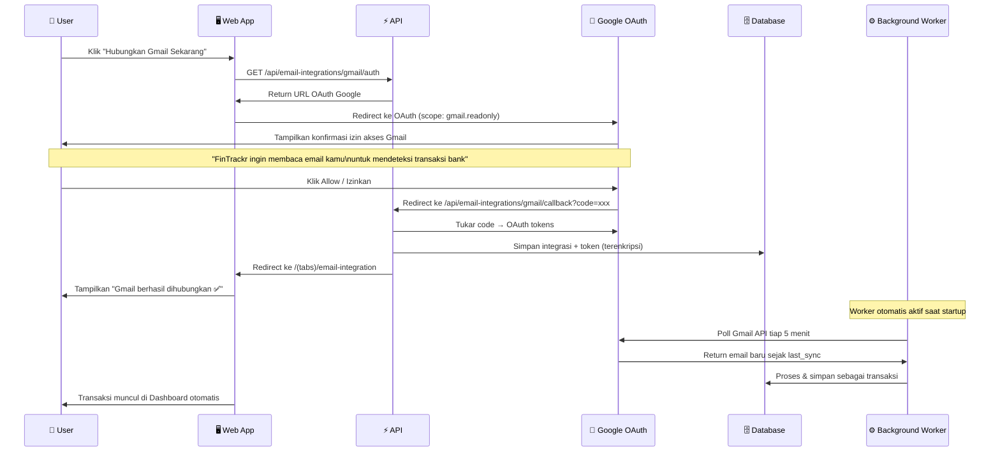
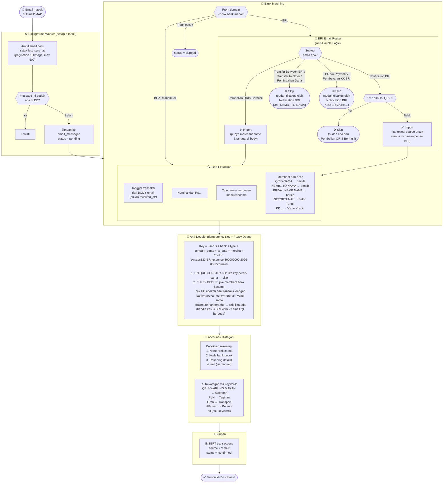
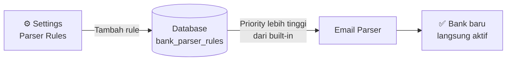
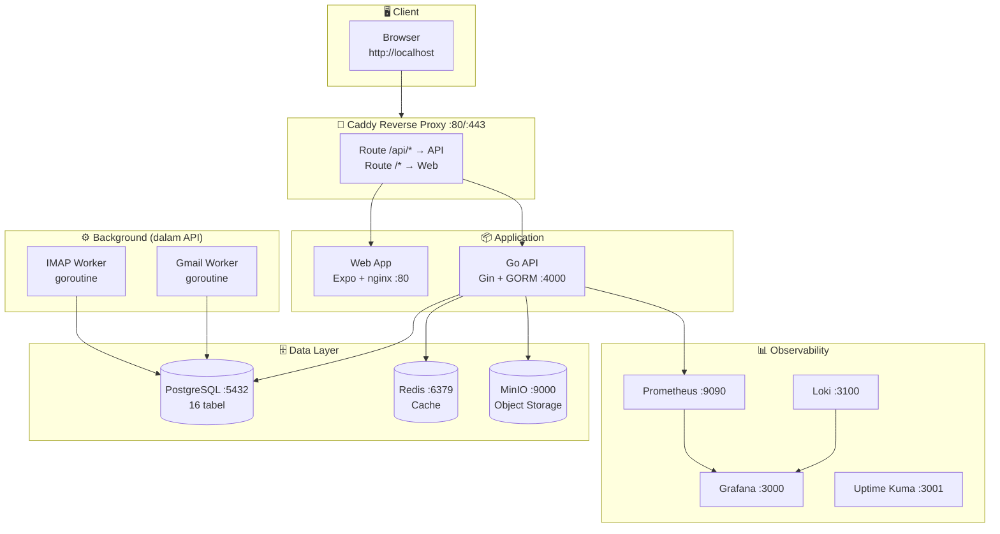
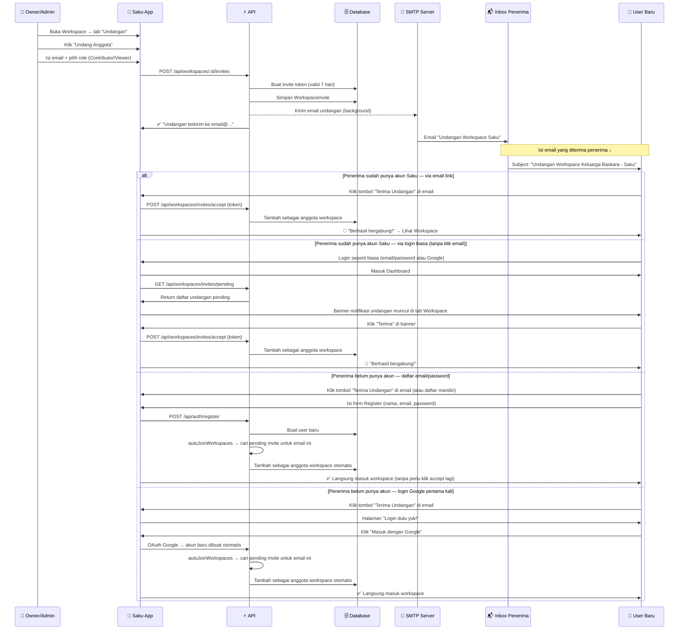
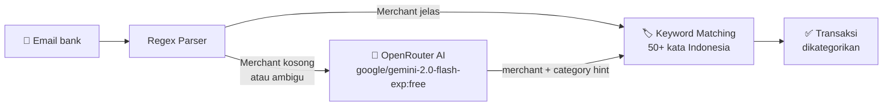

# Saku — Self-Hosted Family Finance Tracker

> **"Saku"** = kantong/dompet dalam bahasa Indonesia 🌿

Aplikasi manajemen keuangan keluarga yang **otomatis mencatat transaksi** dari email notifikasi bank & e-wallet, dengan dukungan **workspace bersama** untuk hingga 5 anggota keluarga.

- **Backend**: Go + Gin + GORM (Clean Architecture)
- **Frontend**: Expo (React Native Web) + Nunito font → nginx static
- **Database**: PostgreSQL 16 + pgvector
- **Proxy**: Caddy (auto-HTTPS di production)
- **Monitoring**: Grafana, Prometheus, Loki, Uptime Kuma

### Design System
- **Primary**: Sage green `#6B8E6B` (bukan navy)
- **Accent**: Clay/terracotta `#C97B5C`
- **Canvas**: Warm cream `#FAF7F2` (bukan pure white)
- **Income = sage**, **Expense = clay** (bukan merah/hijau)

---

## Daftar Isi

1. [Quick Start](#-quick-start)
2. [Deploy & Update](#-deploy--update)
3. [Fitur Lengkap](#-fitur-lengkap)
4. [Cara Kerja Secara Keseluruhan](#-cara-kerja-secara-keseluruhan)
5. [Setup Google OAuth](#-setup-google-oauth-wajib-untuk-login-google--email-integration)
6. [Flow Login & Register](#-flow-login--register)
7. [Flow Email Auto-Import](#-flow-email-auto-import-transaksi)
8. [Flow Workspace & Undangan Anggota](#-flow-workspace--undangan-anggota)
9. [OpenRouter AI Integration](#-openrouter-ai-integration)
10. [Konfigurasi .env](#-konfigurasi-env)
11. [Melihat Log](#-melihat-log)
12. [Perintah Docker Berguna](#-perintah-docker-berguna)
13. [API Reference](#-api-reference-lengkap)
14. [Troubleshooting](#-troubleshooting)

---

## ✨ Fitur Lengkap

### Transaksi
| Fitur | Keterangan |
|---|---|
| **Auto-import dari email** | Gmail & IMAP — BRI, BCA, Mandiri, BNI, GoPay, OVO, DANA, dll |
| **Anti-double import** | Idempotency key berbasis `bank+tipe+jumlah+tanggal_transaksi` |
| **Tambah manual** | Form dengan kategori, rekening, tanggal, merchant, catatan |
| **Detail & edit** | Klik transaksi → modal detail → bisa edit semua field |
| **Hapus transaksi** | Dari modal detail atau long-press di list |
| **Export CSV** | Download semua transaksi bulan ini |
| **Filter & search** | Cari merchant, filter tipe, filter rentang tanggal |
| **Grouped by day** | List dikelompokkan per hari dengan total harian |

### Kategorisasi Otomatis
| Metode | Urutan |
|---|---|
| **AI hint (OpenRouter)** | 1st — jika merchant ambigu, tanya AI |
| **Keyword map (50+ kata)** | 2nd — warung makan→Makanan, grab→Transport, PLN→Tagihan, dll |
| **Nama kategori user** | 3rd — nama kategori vs merchant |
| **Manual** | Fallback — user isi sendiri dari modal edit |

### Email Parser (BRI)
| Jenis Email | Diimport? | Merchant Extraction |
|---|---|---|
| `Notification BRI` | ✅ (canonical) | Dari `Ket.:` field — QRIS/BRIVA/KK/NBMB dibersihkan |
| `Pembelian QRIS Berhasil` | ✅ | `Nama Merchant` field — nama toko jelas |
| `Transfer Between BRI Account` | ❌ | Covered by `Notification BRI` (Ket.: NBMB...TO NAMA) |
| `Pemindahan Dana Sesama Rekening` | ❌ | Covered by `Notification BRI` |
| `Transfer to Other Domestic Bank` | ❌ | Covered by `Notification BRI` |
| `BRIVA Payment Successful` | ❌ | Covered by `Notification BRI` (Ket.: BRIVA...NBMB NAMA) |
| `Pembayaran KK BRI Berhasil` | ❌ | Covered by `Notification BRI` (Ket.: KK...) |
| `Notification BRI` dengan `Ket.: QRIS-` | ❌ | Covered by `Pembelian QRIS Berhasil` |

### Dashboard
| Widget | Keterangan |
|---|---|
| **Saldo bulan ini** | Net balance (income − expense) |
| **Periode fleksibel** | Bulan ini, bulan lalu, 3/6 bulan, tahun, gajian custom |
| **Top kategori** | Bar progress per kategori pengeluaran |
| **Transaksi terbaru** | 4 terakhir, klik untuk detail/edit |
| **Quick insight** | Rasio pengeluaran vs pemasukan |

### Rekening (Multi-Account)
- Bank, e-wallet, tunai, kartu kredit
- Multiple rekening per user
- Auto-matching ke rekening saat import email
- Lihat di **Settings → Rekening & Akun**

### Budget & Anggaran
- Budget per kategori (bulanan/mingguan/tahunan)
- Progress bar dengan alert threshold
- Badge status: Aman / Hampir Habis / Melebihi
- Ringkasan total budget dengan gradient card

### Workspace (Keuangan Bersama)
- Hingga 5 anggota keluarga per workspace
- Role: Owner, Admin, Contributor, Viewer
- **Undang via email** — link accept yang bisa diakses tanpa akun dulu
- Tab Anggota / Undangan / Aktivitas
- Activity log semua aksi workspace

### AI (OpenRouter)
- **Gratis** — default model `google/gemini-2.0-flash-exp:free`
- Fallback kategorisasi ketika keyword tidak match
- Extract merchant dari format email yang tidak dikenal
- Diaktifkan via `OPENROUTER_API_KEY` di `.env`

---

## 🚀 Quick Start

### Prasyarat
- Docker Desktop (Windows/Mac/Linux)
- Git

### Langkah

```powershell
# 1. Clone & masuk folder
git clone <repo-url>
cd FinTracker

# 2. Buat file .env dari template
cp .env.example .env

# 3. (Opsional) Isi Google OAuth di .env — lihat panduan di bawah
#    GOOGLE_CLIENT_ID=...
#    GOOGLE_CLIENT_SECRET=...

# 4. Jalankan semua service
docker compose up -d

# 5. Tunggu semua healthy (~1-2 menit)
docker compose ps

# 6. Buka browser
#    http://localhost
```

### URL Akses

| Service | URL | Keterangan |
|---------|-----|-----------|
| **Web App** | http://localhost | Aplikasi utama |
| **API** | http://localhost/api | REST API |
| **API Health** | http://localhost/api/health | Cek status API |
| **Grafana** | http://localhost:3100 | Monitoring dashboard |
| **Prometheus** | http://localhost:9090 | Metrics |
| **MinIO Console** | http://localhost:9001 | Object storage |
| **Uptime Kuma** | http://localhost:3001 | Status page |

> Untuk akses dev tools (Grafana, MinIO, dll) jalankan dengan override:
> ```powershell
> docker compose -f docker-compose.yml -f docker-compose.dev.yml up -d
> ```

---

## 🚢 Deploy & Update

### Prasyarat Sekali (Windows)

Sebelum pertama kali deploy, pastikan `docker`, `docker-compose`, dan `node` bisa dipanggil langsung dari terminal tanpa full path. Jalankan sekali di PowerShell:

```powershell
# Tambah Docker + Node.js ke User PATH permanen
$userPath = [Environment]::GetEnvironmentVariable("PATH", "User")
$toAdd = "C:\Program Files\Docker\Docker\resources\bin;" +
         "C:\Program Files\nodejs;" +
         "$env:APPDATA\npm;" +
         "C:\Users\$env:USERNAME\AppData\Local\Programs\Git\bin"
[Environment]::SetEnvironmentVariable("PATH", "$toAdd;$userPath", "User")

# Tambah ke PowerShell profile agar aktif di setiap terminal baru
$profileContent = @"

# Dev Tools PATH (Docker, Node.js, npm, Git bash)
`$env:PATH = "C:\Program Files\Docker\Docker\resources\bin;" +
            "C:\Program Files\nodejs;" +
            "`$env:APPDATA\npm;" +
            "C:\Users\`$env:USERNAME\AppData\Local\Programs\Git\bin;" +
            `$env:PATH
"@
Add-Content $PROFILE.CurrentUserAllHosts $profileContent
```

Setelah itu **tutup terminal dan buka baru** — `docker`, `docker-compose`, dan `node` langsung bisa dipakai di project manapun.

---

### Deploy Pertama Kali

```powershell
# 1. Clone repo & masuk folder
git clone <repo-url>
cd FinTracker

# 2. Buat file .env dari template
cp .env.example .env
# Edit .env → isi minimal: JWT_SECRET, JWT_REFRESH_SECRET, POSTGRES_PASSWORD

# 3. Pastikan Docker Desktop sudah running (buka dari Start Menu)

# 4. Build semua image & jalankan
docker-compose up -d --build

# 5. Tunggu semua container healthy (~60-90 detik)
docker-compose ps
```

---

### Deploy Update (Setelah Perubahan Kode)

Setelah ada perubahan kode, hanya perlu rebuild service yang berubah — service lain (PostgreSQL, Redis, dll) **tidak perlu direstart**.

#### Update API (Go backend)

```powershell
# Build + deploy hanya API
docker compose build api
docker compose up -d --no-deps api

# Verifikasi API sehat
curl http://localhost/api/health
# Ekspektasi: {"status":"ok"}
```

#### Update Web (React Native / Expo frontend)

```powershell
# Build + deploy hanya Web
docker compose build web
docker compose up -d --no-deps web
```

#### Update Keduanya Sekaligus

```powershell
docker compose build api web
docker compose up -d --no-deps api web
```

#### Update Semua Service

```powershell
docker compose build
docker compose up -d
```

> Flag `--no-deps` penting: tanpanya, Docker juga merestart dependencies (postgres, redis, minio) yang tidak perlu direstart.

---

### Verifikasi Deployment

```powershell
# Cek semua container berjalan
docker compose ps

# API health check
curl http://localhost/api/health

# Cek log API untuk error
docker logs fintrackr-api-1 --tail=50

# Cek log Web
docker logs fintrackr-web-1 --tail=20
```

Output `docker compose ps` yang sehat:

```
NAME                    STATUS          PORTS
fintrackr-api-1         Up (healthy)    4000/tcp
fintrackr-web-1         Up (healthy)    80/tcp
fintrackr-caddy-1       Up (healthy)    0.0.0.0:80->80/tcp
fintrackr-postgres-1    Up (healthy)    0.0.0.0:5432->5432/tcp
fintrackr-redis-1       Up (healthy)
fintrackr-minio-1       Up (healthy)    9000/tcp
```

---

### Skenario Umum

| Skenario | Perintah |
|----------|---------|
| Update kode Go backend | `docker compose build api && docker compose up -d --no-deps api` |
| Update kode frontend | `docker compose build web && docker compose up -d --no-deps web` |
| Ganti config `.env` | Edit `.env` → `docker compose up -d api` (reload env) |
| Restart service stuck | `docker compose restart api` |
| Lihat log live | `docker logs fintrackr-api-1 -f` |
| Cek resource usage | `docker stats` |
| Stop semua (data tetap) | `docker compose down` |
| Stop + hapus semua data | `docker compose down -v` ⚠️ |

---

### Rollback

Jika ada masalah setelah deploy, rollback dengan checkout commit sebelumnya + rebuild:

```powershell
# Lihat commit sebelumnya
git log --oneline -5

# Checkout ke commit terakhir yang baik
git checkout <commit-hash>

# Rebuild service yang bermasalah
docker compose build api
docker compose up -d --no-deps api
```

---

## 🗺️ Cara Kerja Secara Keseluruhan


---

## 🔑 Setup Google OAuth (Wajib untuk Login Google & Email Integration)

> **Kenapa perlu ini?**
> Google OAuth adalah cara aman agar user bisa login pakai akun Google mereka sendiri
> dan menghubungkan inbox Gmail ke FinTrackr — tanpa perlu share password email ke siapapun.
>
> **Kamu sebagai admin setup sekali → semua user bisa pakai akun Google masing-masing.**

### Konsep Penting



Client ID & Secret **bukan** akun Gmail kamu — mereka adalah "tanda pengenal" bahwa ini aplikasi FinTrackr yang sudah terdaftar di Google. Tiap user tetap login & konek Gmail dengan akun mereka sendiri.

---

### Langkah 1 — Buka Google Cloud Console

Buka: **https://console.cloud.google.com**

Login dengan akun Google yang akan menjadi pemilik aplikasi.

---

### Langkah 2 — Buat Project Baru

```
Klik dropdown project di pojok kiri atas
→ Klik "NEW PROJECT"
→ Project name: FinTrackr
→ Klik CREATE
→ Tunggu loading, pastikan "FinTrackr" terpilih di dropdown
```

---

### Langkah 3 — Aktifkan Gmail API

```
Menu ☰ → APIs & Services → Library
→ Ketik "Gmail API" di search
→ Klik hasil pertama
→ Klik tombol ENABLE
```

---

### Langkah 4 — Buat OAuth Consent Screen

```
Menu ☰ → APIs & Services → OAuth consent screen
→ Pilih "External"
→ Klik CREATE
```

Isi form:
| Field | Isi |
|-------|-----|
| App name | `FinTrackr` |
| User support email | email kamu |
| Developer contact email | email kamu |

```
→ Klik SAVE AND CONTINUE (lewati Scopes, langsung ke Test users)
→ Di "Test users" → klik + ADD USERS
→ Tambahkan email kamu sendiri
→ Klik SAVE AND CONTINUE
→ Klik BACK TO DASHBOARD
```

> **Note**: Selama masih "Testing", hanya email yang ada di Test Users yang bisa login.
> Untuk buka ke publik, klik "PUBLISH APP" → status berubah ke "In production".

---

### Langkah 5 — Buat OAuth Client ID

```
Menu ☰ → APIs & Services → Credentials
→ Klik "+ CREATE CREDENTIALS"
→ Pilih "OAuth client ID"
→ Application type: Web application
→ Name: FinTrackr
```

Di bagian **Authorized redirect URIs**, tambahkan **dua** URI berikut:

```
http://localhost/api/auth/google/callback
http://localhost/api/email-integrations/gmail/callback
```

> Jika deploy ke domain asli (misal `fintrackr.example.com`), tambahkan juga:
> ```
> https://fintrackr.example.com/api/auth/google/callback
> https://fintrackr.example.com/api/email-integrations/gmail/callback
> ```

```
→ Klik CREATE
```

Popup akan muncul berisi **Client ID** dan **Client Secret** — salin keduanya.

---

### Langkah 6 — Isi ke .env dan Restart

Buka file `.env` di folder project, isi bagian Google OAuth:

```env
GOOGLE_CLIENT_ID=123456789-xxxxxxxxxxxx.apps.googleusercontent.com
GOOGLE_CLIENT_SECRET=GOCSPX-xxxxxxxxxxxxxxxxxxxxxxxxxx
GOOGLE_CALLBACK_URL=http://localhost/api/auth/google/callback
```

Restart API agar perubahan aktif:

```powershell
docker compose up -d api
```

Verifikasi berhasil — buka browser:
```
http://localhost/api/auth/google/configured
```
Harus return: `{"configured": true}`

---

### Langkah 7 — Publish App (Opsional, untuk user selain kamu)

Selama status "Testing", hanya email di Test Users yang bisa login. Untuk membuka ke semua user:

```
Google Cloud Console
→ APIs & Services → OAuth consent screen
→ Klik "PUBLISH APP"
→ Konfirmasi
```

> Jika aplikasi belum melalui Google Verification, user akan melihat warning
> "This app isn't verified" — mereka masih bisa lanjut dengan klik "Advanced → Go to FinTrackr".
> Untuk menghilangkan warning, submit verification ke Google (opsional).

---

## 👤 Flow Login & Register

### Flow Lengkap



### Apa yang Terjadi Setelah Login Pertama



---

## 📧 Flow Email Auto-Import Transaksi

### Cara Menghubungkan Gmail



### Pipeline Email → Transaksi



---

### Logika Anti-Double BRI (Detail)

BRI mengirim **beberapa email untuk satu transaksi yang sama**. Contoh:

| Skenario | Email 1 | Email 2 | Strategi |
|---|---|---|---|
| Bayar QRIS Rp 20.000 | `Pembelian QRIS Berhasil` (punya merchant, tx date) | `Notification BRI` dengan `Ket.: QRIS-...` | Import QRIS, **skip** Notification BRI |
| Transfer ke orang (BRI kirim 2x) | `Notification BRI` Ket.: NBMB...TO NURAINI (tgl 25 Mei) | `Notification BRI` Ket.: NBMB...TO NURAINI (tgl 30 Mei, pengiriman ulang BRI) | Import email 1, **skip** email 2 via fuzzy-dedup (sama merchant+amount dalam 30 hari) |
| Transfer ke orang | `Notification BRI` dengan `Ket.: NBMB...TO NAMA` | `Transfer Between BRI Account` | Import Notification BRI, **skip** Transfer (router langsung filter) |
| Bayar tagihan BRIVA | `Notification BRI` dengan `Ket.: BRIVA...NBMB NAMA` | `BRIVA Payment Successful` | Import Notification BRI, **skip** BRIVA Payment (router filter) |
| Bayar KK | `Notification BRI` dengan `Ket.: KK...` | `Pembayaran KK BRI Berhasil` | Import Notification BRI, **skip** KK email (router filter) |

**Kunci utama:** Idempotency key dibuat dari `userID + bank + type + amount + tanggal_transaksi_dari_body_email + merchant` (bukan tanggal email diterima). Ditambah **fuzzy-dedup**: jika merchant tidak kosong, sistem cek apakah sudah ada transaksi dengan bank+type+amount+merchant yang sama dalam 30 hari — sehingga walaupun BRI kirim 2 email untuk transaksi yang sama dengan tanggal berbeda, hanya 1 yang masuk.

---

### Contoh Nyata: Input → Output Parser

| Body Email | Subject | Merchant | Tipe | Jumlah | Kategori |
|---|---|---|---|---|---|
| `...Ket.: QRIS-WARUNG MAKAN PADANG...` | Pembelian QRIS | Warung Makan Padang | expense | Rp 25.000 | Makanan |
| `...Ket.: QRIS-DAPOER BUNDA RITA...` | Pembelian QRIS | Dapoer Bunda Rita | expense | Rp 20.000 | Makanan |
| `...Ket.: QRIS-JUS SARI TEBET BARAT...` | Pembelian QRIS | Jus Sari Tebet Barat | expense | Rp 12.000 | Kopi/Makanan |
| `...Ket.: SETORTUNAI#5221...` | Notification BRI | Setor Tunai | income | Rp 3.000.000 | — |
| `...Ket.: BFST...NBMB:SUNIIDJA` | Notification BRI | Suniidja | income | Rp 1.770.000 | — |
| `...Ket.: BRIVA...NBMBPLNMobil...` | Notification BRI | PLNMobil | expense | Rp 501.750 | Tagihan |
| `...Ket.: KK 436502XXXXXXXX09NBMB...` | Notification BRI | Kartu Kredit | expense | Rp 941.455 | Tagihan |
| `...Ket.: SAP-DD TRANSACTION...` | Notification BRI | SAP-DD Transaction | income | Rp 12.277.937 | — |
| `...Ket.: BRIVA...NBMBMidtrans redB...` | Notification BRI | Midtrans redB | expense | Rp 360.000 | Belanja |
| `Recipient's Name FERDINANDUS HANRY...` | Transfer Between BRI | Ferdinandus Hanry Ku | expense | Rp 360.000 | — |

---

### Status Email Messages

| Status | Artinya | Aksi |
|--------|---------|------|
| `pending` | Baru masuk, belum diproses | Otomatis diproses |
| `imported` | Berhasil jadi transaksi ✅ | — |
| `skipped` | Bukan email bank / duplicate / tidak dikenali | Bisa reprocess jika parser diupdate |
| `failed` | Parser cocok tapi error saat import | Coba reprocess |

---

## 🏦 Bank & E-Wallet yang Didukung

### Built-in (Selalu Aktif)

| Lembaga | Pengirim Email | Deteksi |
|---------|---------------|---------|
| **BCA** | @klikbca.com, @bca.co.id | Debit, Kredit, Transfer |
| **Mandiri** | @bankmandiri.co.id | Debit, Kredit |
| **BRI** | @bri.co.id | Debit, Kredit, Transfer |
| **BNI** | @bni.co.id | Debit, Kredit |
| **GoPay** | @gojek.com, @gopay.co.id | Bayar, Terima, Top-up |
| **OVO** | @ovo.id | Bayar, Terima, Cashback |
| **DANA** | @dana.id | Bayar, Terima |
| **ShopeePay** | @shopee.co.id | Pembayaran, Transfer |
| **Jenius** | @jenius.com, @btpn.com | Bayar, Kirim |
| **Livin' Mandiri** | via Mandiri | Semua transaksi |
| **BSI Mobile** | @bankbsi.co.id | Debit, Kredit |
| **CIMB Niaga** | @cimbniaga.co.id | Debit, Kredit |
| **Permata** | @permatabank.com | Debit, Kredit |
| **Flip** | @flip.id | Transfer |
| **LinkAja** | @linkaja.id | Bayar, Terima |
| **Danamon** | @danamon.co.id | Debit, Kredit |
| **BTN** | @btn.co.id | Debit, Kredit |

### Tambah Bank Baru (Tanpa Edit Kode)

Pergi ke **Settings → Parser Rules → Tambah Rule Baru** di aplikasi.



---

## ⚙️ Konfigurasi .env

File `.env` di root project mengatur semua konfigurasi. Buat dari template:

```powershell
cp .env.example .env
```

### Variabel Penting

```env
# ── App ─────────────────────────────────────────────
NODE_ENV=development         # production untuk deploy VPS
APP_URL=http://localhost      # URL web app (ganti ke domain asli di production)

# ── Database ────────────────────────────────────────
POSTGRES_PASSWORD=ganti_ini  # Password PostgreSQL
DATABASE_URL=postgresql://fintrackr:<POSTGRES_PASSWORD>@postgres:5432/fintrackr

# ── JWT (generate random string 64 karakter) ────────
JWT_SECRET=random_64_karakter_disini
JWT_REFRESH_SECRET=random_64_karakter_lain_disini
JWT_EXPIRES_IN=15m
JWT_REFRESH_EXPIRES_IN=30d

# ── Google OAuth ← ISI INI UNTUK AKTIFKAN LOGIN GOOGLE
GOOGLE_CLIENT_ID=xxx.apps.googleusercontent.com
GOOGLE_CLIENT_SECRET=GOCSPX-xxx
GOOGLE_CALLBACK_URL=http://localhost/api/auth/google/callback

# ── Email SMTP (untuk verifikasi email, undangan, dll)
SMTP_HOST=smtp.gmail.com
SMTP_PORT=587
SMTP_USER=email@gmail.com
SMTP_PASS=app-password-16-karakter  # bukan password biasa! lihat di bawah

# ── Self-Hosted Mode ─────────────────────────────────
SELF_HOSTED_MODE=true
DISABLE_TIER_LIMITS=true     # true = semua fitur premium gratis untuk semua user
```

### Cara Generate Secrets

```powershell
# JWT Secret (Windows PowerShell)
[System.Convert]::ToBase64String([System.Security.Cryptography.RandomNumberGenerator]::GetBytes(48))

# Atau pakai openssl (Git Bash / WSL)
openssl rand -hex 64
```

### Setup Gmail App Password (untuk SMTP)

Gmail tidak izinkan password biasa untuk SMTP — harus pakai App Password:

```
1. Buka https://myaccount.google.com
2. Security → 2-Step Verification → Pastikan aktif
3. Security → App Passwords
4. Select app: Mail | Select device: Other → ketik "FinTrackr"
5. Klik Generate → salin 16 karakter
6. Paste ke SMTP_PASS di .env
```

---

## 📋 Melihat Log

Semua proses berjalan dalam **satu container**: `fintrackr-api-1`

| Yang ingin dilihat | Service | Perintah |
|---|---|---|
| Log API (semua) | `fintrackr-api-1` | `docker logs fintrackr-api-1 -f` |
| Log Gmail Worker (polling) | `fintrackr-api-1` | `docker logs fintrackr-api-1 \| grep -i "gmail\|worker\|poll"` |
| Log IMAP Worker | `fintrackr-api-1` | `docker logs fintrackr-api-1 \| grep -i "imap\|worker"` |
| Log Email Parser (hasil parse) | `fintrackr-api-1` | `docker logs fintrackr-api-1 \| grep -i "import\|parse\|skipped\|duplicate"` |
| Log AI (OpenRouter) | `fintrackr-api-1` | `docker logs fintrackr-api-1 \| grep -i "\[AI\]"` |
| Log undangan workspace | `fintrackr-api-1` | `docker logs fintrackr-api-1 \| grep -i "invite\|workspace"` |
| Log SMTP (email terkirim) | `fintrackr-api-1` | `docker logs fintrackr-api-1 \| grep -i "\[EMAIL\]"` |

> **Dev mode (SMTP tidak dikonfigurasi):** Semua email (undangan, verifikasi, reset password) dicetak ke stdout dengan prefix `[EMAIL]`. Cukup lihat log API untuk dapatkan token/link.

```powershell
# Lihat email undangan workspace di log (jika SMTP tidak dikonfigurasi)
docker logs fintrackr-api-1 | grep -A5 "\[EMAIL\]"

# Lihat transaksi yang berhasil diimport hari ini
docker logs fintrackr-api-1 | grep "imported"

# Lihat email yang diskip beserta alasannya
docker logs fintrackr-api-1 | grep "skipped\|duplicate"

# Live log Gmail Worker
docker logs fintrackr-api-1 -f | grep -i "gmail\|poll"
```

### Flow Email Integration di Log

```
[GmailWorker] polling for user abc123 — found 5 new emails
[EmailImport]  msg gmail:abc → matched BRI Notification, amount=50000, merchant=Warung Padang
[EmailImport]  msg gmail:def → skipped: duplicate (fuzzy match: same bank/type/amount/merchant within 30d)
[EmailImport]  msg gmail:ghi → skipped: no matching bank parser
[EmailImport]  msg gmail:jkl → imported → tx_id=xyz789
```

---

## 🔄 Perintah Docker Berguna

```powershell
# ▶️ Start semua service
docker compose up -d

# ▶️ Start + expose dev ports (Grafana, MinIO, dll)
docker compose -f docker-compose.yml -f docker-compose.dev.yml up -d

# ⏹️ Stop semua service
docker compose down

# ⏹️ Stop + hapus semua data (HATI-HATI!)
docker compose down -v

# 📋 Status semua container
docker compose ps

# 📝 Log API live
docker logs fintrackr-api-1 -f

# 📝 Log semua service live
docker compose logs -f

# 🔨 Rebuild API setelah perubahan kode Go
docker compose build api && docker compose up -d api

# 🔨 Rebuild Web setelah perubahan frontend
docker compose build web && docker compose up -d web

# 🔨 Rebuild semua
docker compose build && docker compose up -d

# 🗄️ Masuk PostgreSQL shell
docker exec -it fintrackr-postgres-1 psql -U fintrackr -d fintrackr

# 🔍 Cek email yang sudah diproses
docker exec -it fintrackr-postgres-1 psql -U fintrackr -d fintrackr \
  -c "SELECT subject, from, parse_status, parsed_amount FROM email_messages ORDER BY created_at DESC LIMIT 10;"
```

---

## 🏗️ Arsitektur



### Clean Architecture Go API

```
apps/api-go/
├── cmd/server/main.go          ← Entry point, wiring semua dependencies
└── internal/
    ├── domain/                 ← Core domain (zero framework dependency)
    │   ├── entity/             ← Struct database (User, Transaction, dll)
    │   ├── repository/         ← Interface repository (port)
    │   └── usecase/            ← Interface use case (port)
    ├── usecase/                ← Business logic implementation
    │   └── email_import_service.go  ← Email → Transaction pipeline
    ├── repository/             ← GORM implementation
    ├── delivery/http/
    │   ├── handler/            ← Gin request handlers
    │   ├── middleware/         ← JWT auth, CORS
    │   └── router.go           ← Semua route
    └── infrastructure/
        ├── config/             ← Load .env
        ├── database/           ← Connect, AutoMigrate, Seed
        ├── email/              ← Dynamic SMTP service
        ├── emailparser/        ← Regex parser bank/ewallet
        └── worker/             ← IMAP + Gmail background pollers
```

---

## 📖 API Reference Lengkap

### Authentication

```
POST   /api/auth/register                  Daftar + kirim verifikasi email
POST   /api/auth/login                     Login email/password
POST   /api/auth/refresh                   Refresh access token (rotation)
GET    /api/auth/google                    Mulai Google OAuth (redirect)
GET    /api/auth/google/callback           Callback Google OAuth
GET    /api/auth/google/configured         Cek apakah Google OAuth aktif di server
POST   /api/auth/verify-email              Verifikasi email via token
POST   /api/auth/forgot-password           Request link reset password
POST   /api/auth/reset-password            Set password baru via token
--- Protected (Bearer token) ---
GET    /api/auth/me                        Profil user saya
POST   /api/auth/logout                    Logout (revoke refresh token)
POST   /api/auth/send-verification         Kirim ulang email verifikasi
POST   /api/auth/change-password           Ganti password
```

### Transaksi, Akun, Kategori, Budget

```
GET|POST              /api/transactions
GET|PATCH|DELETE      /api/transactions/:id
GET|POST              /api/accounts
PATCH|DELETE          /api/accounts/:id
GET|POST              /api/categories
PATCH|DELETE          /api/categories/:id
GET|POST              /api/budgets
PATCH|DELETE          /api/budgets/:id
GET                   /api/budgets/subscriptions
```

### Dashboard

```
GET /api/dashboard/summary              Ringkasan bulan ini
GET /api/dashboard/category-breakdown   Data pie chart pengeluaran
GET /api/dashboard/monthly-trend        Tren 6 bulan (bar chart)
```

### Email Integration

```
GET    /api/email-integrations                  List semua integrasi
POST   /api/email-integrations/imap             Hubungkan via IMAP
GET    /api/email-integrations/gmail/auth       Mulai OAuth Gmail
GET    /api/email-integrations/gmail/callback   Callback OAuth Gmail
DELETE /api/email-integrations/:id             Putuskan integrasi
PATCH  /api/email-integrations/:id/toggle      Aktif / nonaktif
POST   /api/email-integrations/:id/sync        Paksa sync sekarang
```

### Email Messages (Pipeline Inbox)

```
GET    /api/email-messages                      List semua email diproses
                                                ?status=pending|imported|skipped|failed
                                                ?integrationId=<uuid>
GET    /api/email-messages/:id                  Detail + hasil parse
POST   /api/email-messages/:id/reprocess        Coba ulang parse + import
DELETE /api/email-messages/:id                  Hapus record
```

### Settings & Parser Rules

```
GET|PUT               /api/settings/smtp                  Konfigurasi SMTP
POST                  /api/settings/smtp/test             Kirim email tes
GET                   /api/settings/parser-rules          Semua parser rules
GET                   /api/settings/parser-rules/active   Rules aktif saja
POST                  /api/settings/parser-rules          Tambah rule baru
PATCH                 /api/settings/parser-rules/:id      Edit rule
PATCH                 /api/settings/parser-rules/:id/toggle  Toggle aktif
DELETE                /api/settings/parser-rules/:id      Hapus rule
```

### Workspace

```
GET|POST              /api/workspaces
GET|PATCH|DELETE      /api/workspaces/:id
GET                   /api/workspaces/:id/members
PATCH|DELETE          /api/workspaces/:id/members/:userId
DELETE                /api/workspaces/:id/leave
POST                  /api/workspaces/:id/invites         Undang anggota via email
GET                   /api/workspaces/:id/invites         List undangan workspace
DELETE                /api/workspaces/:id/invites/:id     Cabut undangan
POST                  /api/workspaces/invites/accept      Terima undangan (token)
POST                  /api/workspaces/invites/decline     Tolak undangan (token)
GET                   /api/workspaces/invites/pending     Inbox undangan user ini ← notif UI
GET                   /api/workspaces/:id/activity
```

---

## 👨‍👩‍👧 Flow Workspace & Undangan Anggota

Workspace adalah fitur **keuangan bersama** — 1 workspace bisa dipakai oleh hingga 5 anggota keluarga. Setiap anggota punya role yang berbeda.

### Role Anggota

| Role | Bisa Lihat | Bisa Tambah Transaksi | Bisa Undang | Bisa Kelola Workspace |
|------|-----------|----------------------|-------------|----------------------|
| **Owner** | ✅ | ✅ | ✅ | ✅ |
| **Admin** | ✅ | ✅ | ✅ | ✅ |
| **Contributor** | ✅ | ✅ | ❌ | ❌ |
| **Viewer** | ✅ | ❌ | ❌ | ❌ |

---

### Flow Mengundang Anggota via Email



---

### Tampilan Email yang Diterima

Email dikirim dari SMTP yang dikonfigurasi di Settings dengan format berikut:

```
┌─────────────────────────────────────────────────┐
│  🌿 Saku                          [Header Sage]  │
│  Undangan Workspace                              │
├─────────────────────────────────────────────────┤
│                                                 │
│  Halo,                                          │
│                                                 │
│  Renaldy mengundang kamu untuk bergabung        │
│  ke workspace "Keluarga Baskara" di Saku.       │
│                                                 │
│         ┌──────────────────────┐                │
│         │   Terima Undangan    │  ← tombol sage │
│         └──────────────────────┘                │
│                                                 │
│  Link berlaku selama 7 hari.                    │
│  Jika tidak mengenal pengirim, abaikan.         │
│                                                 │
├─────────────────────────────────────────────────┤
│  Saku · Self-Hosted Financial Tracker           │
│  Email ini dikirim otomatis, jangan dibalas.    │
└─────────────────────────────────────────────────┘
```

Tombol "Terima Undangan" mengarah ke:
```
http://localhost/workspace/accept-invite?token=<token_unik_7_hari>
```

---

### Halaman Accept Invite (Frontend)

Halaman `/workspace/accept-invite` menangani 3 kondisi:

```
Token valid + sudah login  →  Langsung join  →  "🎉 Berhasil bergabung!"
Token valid + belum login  →  Tampilkan Login Google  →  Setelah login → join
Token expired/invalid      →  "😕 Undangan tidak valid"
```

### Banner Notifikasi Undangan (Existing User)

Untuk existing user yang login tanpa mengklik link email, undangan muncul sebagai **banner di tab Workspace**. Banner ini:
- Muncul otomatis saat membuka tab Workspace
- Menampilkan nama workspace + nama pengundang
- Tombol **Terima** dan **Tolak** langsung di banner

```
┌────────────────────────────────────────────────────┐
│  📨 Kamu diundang ke "Keluarga Baskara"            │
│  oleh Renaldy · sebagai Contributor                │
│  [Terima]  [Tolak]                                 │
└────────────────────────────────────────────────────┘
```

---

### Kelola Undangan yang Sudah Dikirim

Di tab **"Undangan"** dalam detail workspace:
- Lihat semua undangan pending (email + role + expired date)
- **Cabut undangan** sebelum diterima — klik ikon hapus
- Undangan expired otomatis tidak bisa digunakan

---

### Prasyarat Undangan Email Berfungsi

SMTP harus dikonfigurasi di **Settings → Konfigurasi Email (SMTP)**. Tanpa SMTP, undangan tetap tersimpan di database tapi email tidak terkirim.

Untuk testing tanpa SMTP, token undangan bisa dicek di log API:
```powershell
docker logs fintrackr-api-1 | grep "invite"
```

---

## 🤖 OpenRouter AI Integration

AI digunakan sebagai **fallback** ketika regex parser tidak bisa menentukan merchant atau kategori dari email bank.

### Cara Kerja



### Setup

Daftar di [openrouter.ai](https://openrouter.ai) → ambil API key → isi di `.env`:

```env
OPENROUTER_API_KEY=sk-or-v1-xxxxxxxxxxxx
OPENROUTER_MODEL=google/gemini-2.0-flash-exp:free  # gratis, tidak perlu kredit
```

### Model Gratis yang Tersedia

| Model | Keterangan |
|---|---|
| `google/gemini-2.0-flash-exp:free` | **Default** — cepat, akurat untuk Bahasa Indonesia |
| `meta-llama/llama-3.1-8b-instruct:free` | Alternatif open-source |
| `mistralai/mistral-7b-instruct:free` | Alternatif |

> Jika `OPENROUTER_API_KEY` tidak diisi, AI dinonaktifkan — keyword matching tetap berjalan.

### Startup Log

```
✅ OpenRouter AI enabled (model: google/gemini-2.0-flash-exp:free)
# atau
ℹ️  OpenRouter AI disabled — set OPENROUTER_API_KEY to enable
```

---

## ❗ Troubleshooting

### Google OAuth — "This app isn't verified"

Normal untuk app baru. Klik **Advanced → Go to FinTrackr (unsafe)** untuk lanjut.
Hilang setelah submit Google Verification (opsional untuk app internal).

### Google OAuth — Redirect URI mismatch

Pastikan URI di Google Console **persis sama** dengan di `.env`:
```
Google Console:   http://localhost/api/auth/google/callback
.env:             GOOGLE_CALLBACK_URL=http://localhost/api/auth/google/callback
```

### Email bank tidak ter-import

```powershell
# 1. Cek integrasi aktif
curl http://localhost/api/email-integrations -H "Authorization: Bearer <token>"

# 2. Lihat email yang di-skip
curl "http://localhost/api/email-messages?status=skipped" -H "Authorization: Bearer <token>"

# 3. Cek log worker
docker logs fintrackr-api-1 | grep -i "worker\|imap\|gmail"

# 4. Paksa sync manual
curl -X POST http://localhost/api/email-integrations/<id>/sync -H "Authorization: Bearer <token>"
```

### Email verifikasi tidak sampai

```powershell
# Lihat token verifikasi di log (mode dev)
docker logs fintrackr-api-1 | grep -i "EMAIL\|verify"

# Atau verifikasi langsung via API
curl -X POST http://localhost/api/auth/verify-email \
  -H "Content-Type: application/json" \
  -d '{"token": "<token dari log>"}'
```

### Service unhealthy

```powershell
# Cek status semua container
docker compose ps

# Lihat log service yang bermasalah
docker compose logs <nama-service> --tail=50

# Restart service tertentu
docker compose restart <nama-service>
```

### Reset semua data (mulai dari awal)

```powershell
# HATI-HATI: hapus semua data!
docker compose down -v
docker compose up -d
```

---

## 📄 Lisensi

Self-hosted, open-source. Lihat file `LICENSE`.

---

*Saku v1.0.0 · Go + Expo + PostgreSQL · Self-Hosted*
