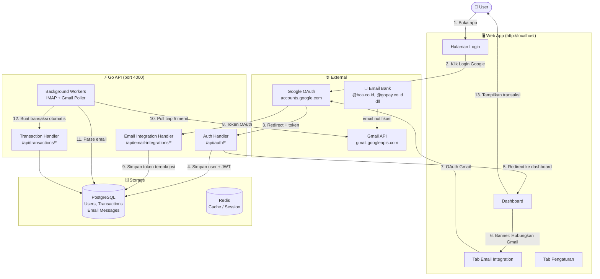
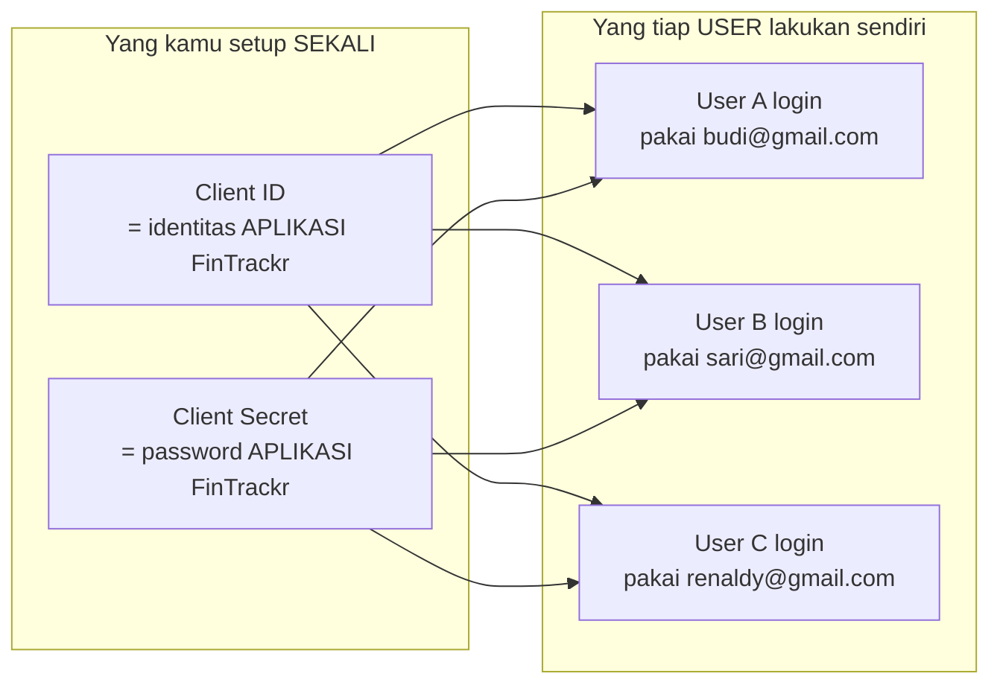
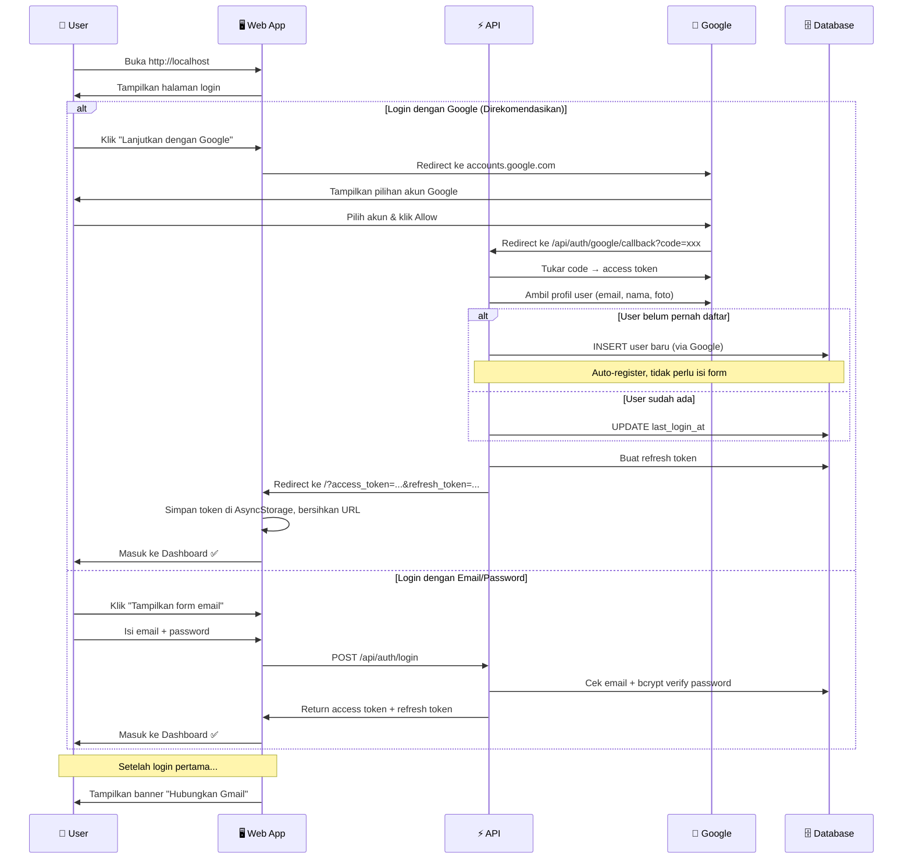
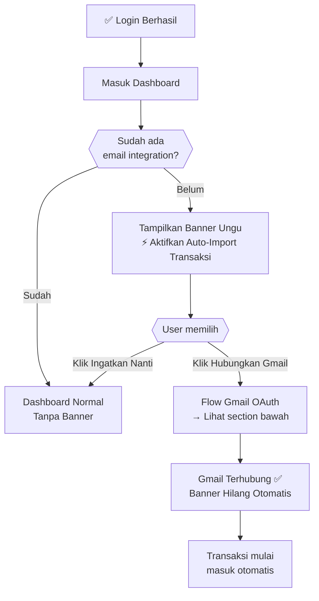
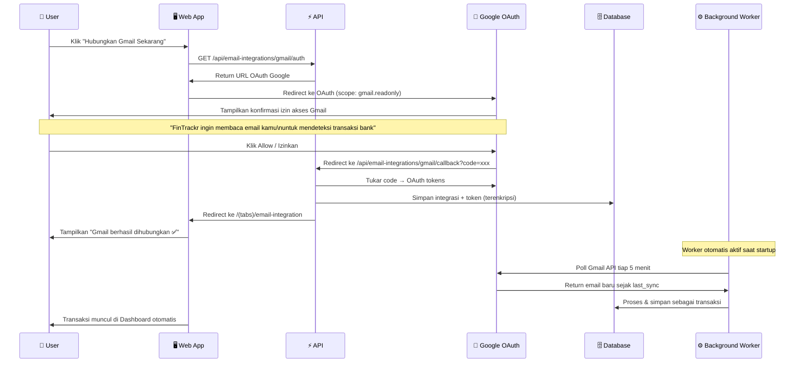
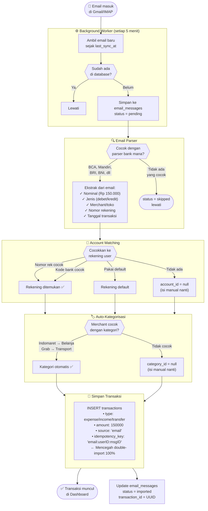
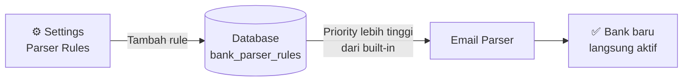
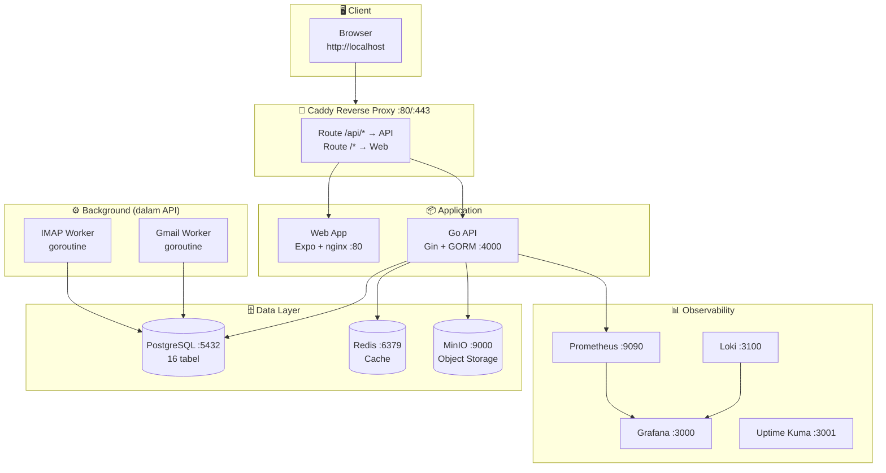

# FinTrackr — Self-Hosted Financial Tracker

Aplikasi manajemen keuangan personal yang **otomatis mencatat transaksi** dari email notifikasi bank & e-wallet.

- **Backend**: Go + Gin + GORM (Clean Architecture)
- **Frontend**: Expo (React Native Web) → nginx static
- **Database**: PostgreSQL 16 + pgvector
- **Proxy**: Caddy (auto-HTTPS di production)
- **Monitoring**: Grafana, Prometheus, Loki, Uptime Kuma

---

## Daftar Isi

1. [Quick Start](#-quick-start)
2. [Cara Kerja Secara Keseluruhan](#-cara-kerja-secara-keseluruhan)
3. [Setup Google OAuth](#-setup-google-oauth-wajib-untuk-login-google--email-integration)
4. [Flow Login & Register](#-flow-login--register)
5. [Flow Email Auto-Import](#-flow-email-auto-import-transaksi)
6. [Fitur Aplikasi](#-fitur-aplikasi)
7. [Konfigurasi .env](#-konfigurasi-env)
8. [Perintah Docker Berguna](#-perintah-docker-berguna)
9. [API Reference](#-api-reference-lengkap)
10. [Troubleshooting](#-troubleshooting)

---

## 🚀 Quick Start

### Prasyarat
- Docker Desktop (Windows/Mac/Linux)
- Git

### Langkah

```powershell
# 1. Clone & masuk folder
git clone <repo-url>
cd FinTracker

# 2. Buat file .env dari template
cp .env.example .env

# 3. (Opsional) Isi Google OAuth di .env — lihat panduan di bawah
#    GOOGLE_CLIENT_ID=...
#    GOOGLE_CLIENT_SECRET=...

# 4. Jalankan semua service
docker compose up -d

# 5. Tunggu semua healthy (~1-2 menit)
docker compose ps

# 6. Buka browser
#    http://localhost
```

### URL Akses

| Service | URL | Keterangan |
|---------|-----|-----------|
| **Web App** | http://localhost | Aplikasi utama |
| **API** | http://localhost/api | REST API |
| **API Health** | http://localhost/api/health | Cek status API |
| **Grafana** | http://localhost:3100 | Monitoring dashboard |
| **Prometheus** | http://localhost:9090 | Metrics |
| **MinIO Console** | http://localhost:9001 | Object storage |
| **Uptime Kuma** | http://localhost:3001 | Status page |

> Untuk akses dev tools (Grafana, MinIO, dll) jalankan dengan override:
> ```powershell
> docker compose -f docker-compose.yml -f docker-compose.dev.yml up -d
> ```

---

## 🗺️ Cara Kerja Secara Keseluruhan



---

## 🔑 Setup Google OAuth (Wajib untuk Login Google & Email Integration)

> **Kenapa perlu ini?**
> Google OAuth adalah cara aman agar user bisa login pakai akun Google mereka sendiri
> dan menghubungkan inbox Gmail ke FinTrackr — tanpa perlu share password email ke siapapun.
>
> **Kamu sebagai admin setup sekali → semua user bisa pakai akun Google masing-masing.**

### Konsep Penting



Client ID & Secret **bukan** akun Gmail kamu — mereka adalah "tanda pengenal" bahwa ini aplikasi FinTrackr yang sudah terdaftar di Google. Tiap user tetap login & konek Gmail dengan akun mereka sendiri.

---

### Langkah 1 — Buka Google Cloud Console

Buka: **https://console.cloud.google.com**

Login dengan akun Google yang akan menjadi pemilik aplikasi.

---

### Langkah 2 — Buat Project Baru

```
Klik dropdown project di pojok kiri atas
→ Klik "NEW PROJECT"
→ Project name: FinTrackr
→ Klik CREATE
→ Tunggu loading, pastikan "FinTrackr" terpilih di dropdown
```

---

### Langkah 3 — Aktifkan Gmail API

```
Menu ☰ → APIs & Services → Library
→ Ketik "Gmail API" di search
→ Klik hasil pertama
→ Klik tombol ENABLE
```

---

### Langkah 4 — Buat OAuth Consent Screen

```
Menu ☰ → APIs & Services → OAuth consent screen
→ Pilih "External"
→ Klik CREATE
```

Isi form:
| Field | Isi |
|-------|-----|
| App name | `FinTrackr` |
| User support email | email kamu |
| Developer contact email | email kamu |

```
→ Klik SAVE AND CONTINUE (lewati Scopes, langsung ke Test users)
→ Di "Test users" → klik + ADD USERS
→ Tambahkan email kamu sendiri
→ Klik SAVE AND CONTINUE
→ Klik BACK TO DASHBOARD
```

> **Note**: Selama masih "Testing", hanya email yang ada di Test Users yang bisa login.
> Untuk buka ke publik, klik "PUBLISH APP" → status berubah ke "In production".

---

### Langkah 5 — Buat OAuth Client ID

```
Menu ☰ → APIs & Services → Credentials
→ Klik "+ CREATE CREDENTIALS"
→ Pilih "OAuth client ID"
→ Application type: Web application
→ Name: FinTrackr
```

Di bagian **Authorized redirect URIs**, tambahkan **dua** URI berikut:

```
http://localhost/api/auth/google/callback
http://localhost/api/email-integrations/gmail/callback
```

> Jika deploy ke domain asli (misal `fintrackr.example.com`), tambahkan juga:
> ```
> https://fintrackr.example.com/api/auth/google/callback
> https://fintrackr.example.com/api/email-integrations/gmail/callback
> ```

```
→ Klik CREATE
```

Popup akan muncul berisi **Client ID** dan **Client Secret** — salin keduanya.

---

### Langkah 6 — Isi ke .env dan Restart

Buka file `.env` di folder project, isi bagian Google OAuth:

```env
GOOGLE_CLIENT_ID=123456789-xxxxxxxxxxxx.apps.googleusercontent.com
GOOGLE_CLIENT_SECRET=GOCSPX-xxxxxxxxxxxxxxxxxxxxxxxxxx
GOOGLE_CALLBACK_URL=http://localhost/api/auth/google/callback
```

Restart API agar perubahan aktif:

```powershell
docker compose up -d api
```

Verifikasi berhasil — buka browser:
```
http://localhost/api/auth/google/configured
```
Harus return: `{"configured": true}`

---

### Langkah 7 — Publish App (Opsional, untuk user selain kamu)

Selama status "Testing", hanya email di Test Users yang bisa login. Untuk membuka ke semua user:

```
Google Cloud Console
→ APIs & Services → OAuth consent screen
→ Klik "PUBLISH APP"
→ Konfirmasi
```

> Jika aplikasi belum melalui Google Verification, user akan melihat warning
> "This app isn't verified" — mereka masih bisa lanjut dengan klik "Advanced → Go to FinTrackr".
> Untuk menghilangkan warning, submit verification ke Google (opsional).

---

## 👤 Flow Login & Register

### Flow Lengkap



### Apa yang Terjadi Setelah Login Pertama



---

## 📧 Flow Email Auto-Import Transaksi

### Cara Menghubungkan Gmail



### Pipeline Email → Transaksi



### Status Email Messages

| Status | Artinya | Aksi |
|--------|---------|------|
| `pending` | Baru masuk, belum diproses | Otomatis diproses |
| `imported` | Berhasil jadi transaksi ✅ | — |
| `skipped` | Bukan email bank/tidak dikenali | Bisa reprocess jika parser diupdate |
| `failed` | Parser cocok tapi error saat import | Coba reprocess |

---

## 🏦 Bank & E-Wallet yang Didukung

### Built-in (Selalu Aktif)

| Lembaga | Pengirim Email | Deteksi |
|---------|---------------|---------|
| **BCA** | @klikbca.com, @bca.co.id | Debit, Kredit, Transfer |
| **Mandiri** | @bankmandiri.co.id | Debit, Kredit |
| **BRI** | @bri.co.id | Debit, Kredit, Transfer |
| **BNI** | @bni.co.id | Debit, Kredit |
| **GoPay** | @gojek.com, @gopay.co.id | Bayar, Terima, Top-up |
| **OVO** | @ovo.id | Bayar, Terima, Cashback |
| **DANA** | @dana.id | Bayar, Terima |
| **ShopeePay** | @shopee.co.id | Pembayaran, Transfer |
| **Jenius** | @jenius.com, @btpn.com | Bayar, Kirim |
| **Livin' Mandiri** | via Mandiri | Semua transaksi |
| **BSI Mobile** | @bankbsi.co.id | Debit, Kredit |
| **CIMB Niaga** | @cimbniaga.co.id | Debit, Kredit |
| **Permata** | @permatabank.com | Debit, Kredit |
| **Flip** | @flip.id | Transfer |
| **LinkAja** | @linkaja.id | Bayar, Terima |
| **Danamon** | @danamon.co.id | Debit, Kredit |
| **BTN** | @btn.co.id | Debit, Kredit |

### Tambah Bank Baru (Tanpa Edit Kode)

Pergi ke **Settings → Parser Rules → Tambah Rule Baru** di aplikasi.



---

## ⚙️ Konfigurasi .env

File `.env` di root project mengatur semua konfigurasi. Buat dari template:

```powershell
cp .env.example .env
```

### Variabel Penting

```env
# ── App ─────────────────────────────────────────────
NODE_ENV=development         # production untuk deploy VPS
APP_URL=http://localhost      # URL web app (ganti ke domain asli di production)

# ── Database ────────────────────────────────────────
POSTGRES_PASSWORD=ganti_ini  # Password PostgreSQL
DATABASE_URL=postgresql://fintrackr:<POSTGRES_PASSWORD>@postgres:5432/fintrackr

# ── JWT (generate random string 64 karakter) ────────
JWT_SECRET=random_64_karakter_disini
JWT_REFRESH_SECRET=random_64_karakter_lain_disini
JWT_EXPIRES_IN=15m
JWT_REFRESH_EXPIRES_IN=30d

# ── Google OAuth ← ISI INI UNTUK AKTIFKAN LOGIN GOOGLE
GOOGLE_CLIENT_ID=xxx.apps.googleusercontent.com
GOOGLE_CLIENT_SECRET=GOCSPX-xxx
GOOGLE_CALLBACK_URL=http://localhost/api/auth/google/callback

# ── Email SMTP (untuk verifikasi email, undangan, dll)
SMTP_HOST=smtp.gmail.com
SMTP_PORT=587
SMTP_USER=email@gmail.com
SMTP_PASS=app-password-16-karakter  # bukan password biasa! lihat di bawah

# ── Self-Hosted Mode ─────────────────────────────────
SELF_HOSTED_MODE=true
DISABLE_TIER_LIMITS=true     # true = semua fitur premium gratis untuk semua user
```

### Cara Generate Secrets

```powershell
# JWT Secret (Windows PowerShell)
[System.Convert]::ToBase64String([System.Security.Cryptography.RandomNumberGenerator]::GetBytes(48))

# Atau pakai openssl (Git Bash / WSL)
openssl rand -hex 64
```

### Setup Gmail App Password (untuk SMTP)

Gmail tidak izinkan password biasa untuk SMTP — harus pakai App Password:

```
1. Buka https://myaccount.google.com
2. Security → 2-Step Verification → Pastikan aktif
3. Security → App Passwords
4. Select app: Mail | Select device: Other → ketik "FinTrackr"
5. Klik Generate → salin 16 karakter
6. Paste ke SMTP_PASS di .env
```

---

## 🔄 Perintah Docker Berguna

```powershell
# ▶️ Start semua service
docker compose up -d

# ▶️ Start + expose dev ports (Grafana, MinIO, dll)
docker compose -f docker-compose.yml -f docker-compose.dev.yml up -d

# ⏹️ Stop semua service
docker compose down

# ⏹️ Stop + hapus semua data (HATI-HATI!)
docker compose down -v

# 📋 Status semua container
docker compose ps

# 📝 Log API live
docker logs fintrackr-api-1 -f

# 📝 Log semua service live
docker compose logs -f

# 🔨 Rebuild API setelah perubahan kode Go
docker compose build api && docker compose up -d api

# 🔨 Rebuild Web setelah perubahan frontend
docker compose build web && docker compose up -d web

# 🔨 Rebuild semua
docker compose build && docker compose up -d

# 🗄️ Masuk PostgreSQL shell
docker exec -it fintrackr-postgres-1 psql -U fintrackr -d fintrackr

# 🔍 Cek email yang sudah diproses
docker exec -it fintrackr-postgres-1 psql -U fintrackr -d fintrackr \
  -c "SELECT subject, from, parse_status, parsed_amount FROM email_messages ORDER BY created_at DESC LIMIT 10;"
```

---

## 🏗️ Arsitektur



### Clean Architecture Go API

```
apps/api-go/
├── cmd/server/main.go          ← Entry point, wiring semua dependencies
└── internal/
    ├── domain/                 ← Core domain (zero framework dependency)
    │   ├── entity/             ← Struct database (User, Transaction, dll)
    │   ├── repository/         ← Interface repository (port)
    │   └── usecase/            ← Interface use case (port)
    ├── usecase/                ← Business logic implementation
    │   └── email_import_service.go  ← Email → Transaction pipeline
    ├── repository/             ← GORM implementation
    ├── delivery/http/
    │   ├── handler/            ← Gin request handlers
    │   ├── middleware/         ← JWT auth, CORS
    │   └── router.go           ← Semua route
    └── infrastructure/
        ├── config/             ← Load .env
        ├── database/           ← Connect, AutoMigrate, Seed
        ├── email/              ← Dynamic SMTP service
        ├── emailparser/        ← Regex parser bank/ewallet
        └── worker/             ← IMAP + Gmail background pollers
```

---

## 📖 API Reference Lengkap

### Authentication

```
POST   /api/auth/register                  Daftar + kirim verifikasi email
POST   /api/auth/login                     Login email/password
POST   /api/auth/refresh                   Refresh access token (rotation)
GET    /api/auth/google                    Mulai Google OAuth (redirect)
GET    /api/auth/google/callback           Callback Google OAuth
GET    /api/auth/google/configured         Cek apakah Google OAuth aktif di server
POST   /api/auth/verify-email              Verifikasi email via token
POST   /api/auth/forgot-password           Request link reset password
POST   /api/auth/reset-password            Set password baru via token
--- Protected (Bearer token) ---
GET    /api/auth/me                        Profil user saya
POST   /api/auth/logout                    Logout (revoke refresh token)
POST   /api/auth/send-verification         Kirim ulang email verifikasi
POST   /api/auth/change-password           Ganti password
```

### Transaksi, Akun, Kategori, Budget

```
GET|POST              /api/transactions
GET|PATCH|DELETE      /api/transactions/:id
GET|POST              /api/accounts
PATCH|DELETE          /api/accounts/:id
GET|POST              /api/categories
PATCH|DELETE          /api/categories/:id
GET|POST              /api/budgets
PATCH|DELETE          /api/budgets/:id
GET                   /api/budgets/subscriptions
```

### Dashboard

```
GET /api/dashboard/summary              Ringkasan bulan ini
GET /api/dashboard/category-breakdown   Data pie chart pengeluaran
GET /api/dashboard/monthly-trend        Tren 6 bulan (bar chart)
```

### Email Integration

```
GET    /api/email-integrations                  List semua integrasi
POST   /api/email-integrations/imap             Hubungkan via IMAP
GET    /api/email-integrations/gmail/auth       Mulai OAuth Gmail
GET    /api/email-integrations/gmail/callback   Callback OAuth Gmail
DELETE /api/email-integrations/:id             Putuskan integrasi
PATCH  /api/email-integrations/:id/toggle      Aktif / nonaktif
POST   /api/email-integrations/:id/sync        Paksa sync sekarang
```

### Email Messages (Pipeline Inbox)

```
GET    /api/email-messages                      List semua email diproses
                                                ?status=pending|imported|skipped|failed
                                                ?integrationId=<uuid>
GET    /api/email-messages/:id                  Detail + hasil parse
POST   /api/email-messages/:id/reprocess        Coba ulang parse + import
DELETE /api/email-messages/:id                  Hapus record
```

### Settings & Parser Rules

```
GET|PUT               /api/settings/smtp                  Konfigurasi SMTP
POST                  /api/settings/smtp/test             Kirim email tes
GET                   /api/settings/parser-rules          Semua parser rules
GET                   /api/settings/parser-rules/active   Rules aktif saja
POST                  /api/settings/parser-rules          Tambah rule baru
PATCH                 /api/settings/parser-rules/:id      Edit rule
PATCH                 /api/settings/parser-rules/:id/toggle  Toggle aktif
DELETE                /api/settings/parser-rules/:id      Hapus rule
```

### Workspace

```
GET|POST              /api/workspaces
GET|PATCH|DELETE      /api/workspaces/:id
GET                   /api/workspaces/:id/members
PATCH|DELETE          /api/workspaces/:id/members/:userId
DELETE                /api/workspaces/:id/leave
POST                  /api/workspaces/:id/invites         Undang via email
GET                   /api/workspaces/:id/invites
DELETE                /api/workspaces/:id/invites/:id
POST                  /api/workspaces/invites/accept
POST                  /api/workspaces/invites/decline
GET                   /api/workspaces/:id/activity
```

---

## ❗ Troubleshooting

### Google OAuth — "This app isn't verified"

Normal untuk app baru. Klik **Advanced → Go to FinTrackr (unsafe)** untuk lanjut.
Hilang setelah submit Google Verification (opsional untuk app internal).

### Google OAuth — Redirect URI mismatch

Pastikan URI di Google Console **persis sama** dengan di `.env`:
```
Google Console:   http://localhost/api/auth/google/callback
.env:             GOOGLE_CALLBACK_URL=http://localhost/api/auth/google/callback
```

### Email bank tidak ter-import

```powershell
# 1. Cek integrasi aktif
curl http://localhost/api/email-integrations -H "Authorization: Bearer <token>"

# 2. Lihat email yang di-skip
curl "http://localhost/api/email-messages?status=skipped" -H "Authorization: Bearer <token>"

# 3. Cek log worker
docker logs fintrackr-api-1 | grep -i "worker\|imap\|gmail"

# 4. Paksa sync manual
curl -X POST http://localhost/api/email-integrations/<id>/sync -H "Authorization: Bearer <token>"
```

### Email verifikasi tidak sampai

```powershell
# Lihat token verifikasi di log (mode dev)
docker logs fintrackr-api-1 | grep -i "EMAIL\|verify"

# Atau verifikasi langsung via API
curl -X POST http://localhost/api/auth/verify-email \
  -H "Content-Type: application/json" \
  -d '{"token": "<token dari log>"}'
```

### Service unhealthy

```powershell
# Cek status semua container
docker compose ps

# Lihat log service yang bermasalah
docker compose logs <nama-service> --tail=50

# Restart service tertentu
docker compose restart <nama-service>
```

### Reset semua data (mulai dari awal)

```powershell
# HATI-HATI: hapus semua data!
docker compose down -v
docker compose up -d
```

---

## 📄 Lisensi

Self-hosted, open-source. Lihat file `LICENSE`.

---

*FinTrackr v1.0.0 · Go + Expo + PostgreSQL · Self-Hosted*
